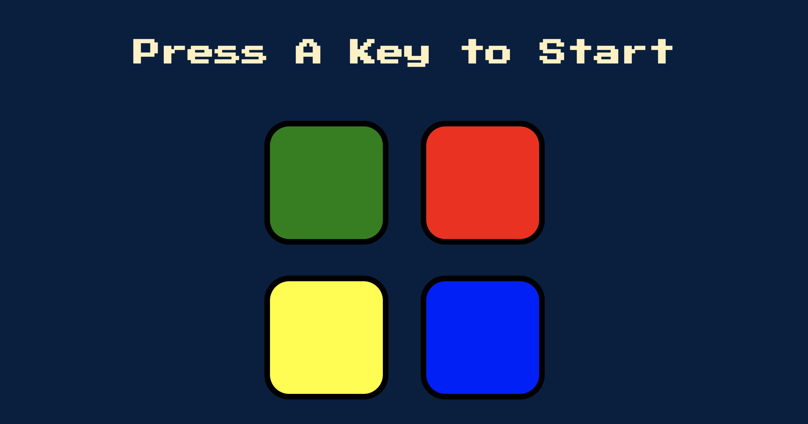

# Simon - The Memory Game

## Description

Simon is a classic memory game that challenges your ability to recall sequences of colors and sounds. It's a fun and engaging way to test and improve your memory skills. 

## How to Play

1. The game begins by displaying the first color in the sequence, for example, "Blue."

2. The player clicks on the button corresponding to the displayed color, in this case, the "Blue" button.

3. Simon then adds the next color to the sequence, for example, "Red."

4. The player's task is to remember the sequence. In this case, it's "Blue," "Red," and so on.

5. The game continues to add colors to the sequence, and the player must repeat the entire sequence correctly.

6. If the player makes a mistake and fails to repeat the sequence correctly, the game ends.

## Features

- A fun and challenging memory game.
- Classic gameplay inspired by the original Simon game.
- Engaging sound and visual feedback to enhance the gaming experience.
- Test and improve your memory skills.
- Suitable for players of all ages.

## How to Run

1. Clone this repository to your local machine.
2. Open the index.html file in your web browser.
3. OR just use this link to play the game without any fuss!!

## Technologies Used

- HTML
- CSS
- JavaScript

## Credits

- Sound effects and design inspired by the original Simon game.

## Author

- Aman Pandey & Dr. Anglea Yu from Udemy